## Lab Report 1  
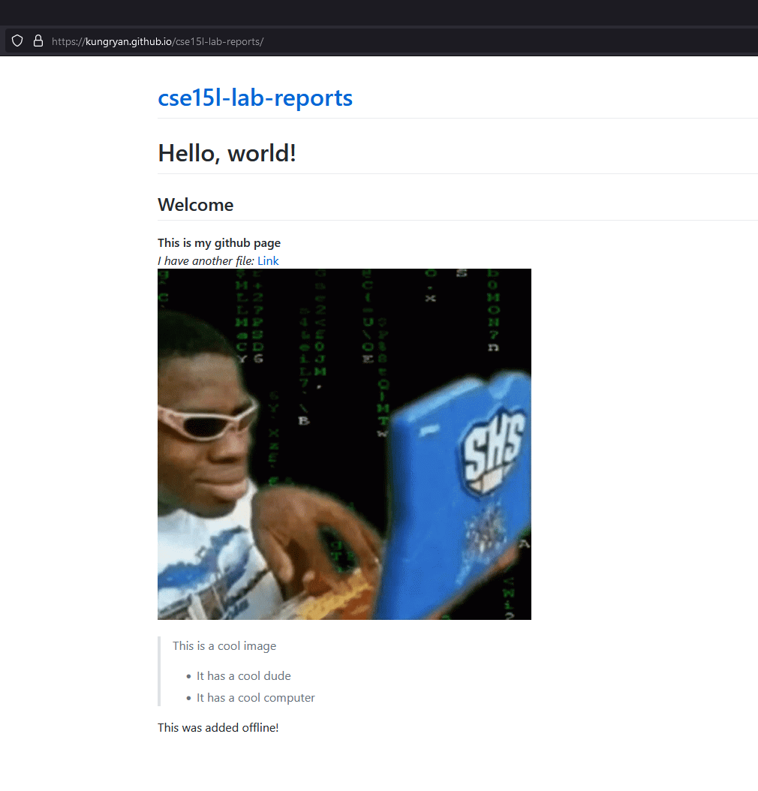  
This is a screenshot of my index.  
  
## Connecting to ieng6  
Hello incoming 15L students! *(and possibly future me)*  
This post will demonstrate how **you** can connect to your course-specific acccount on ieng6!  

## **1. Installing VScode**  
Download VScode from its website for the platform you are using it on. (I am running it on Windows)  
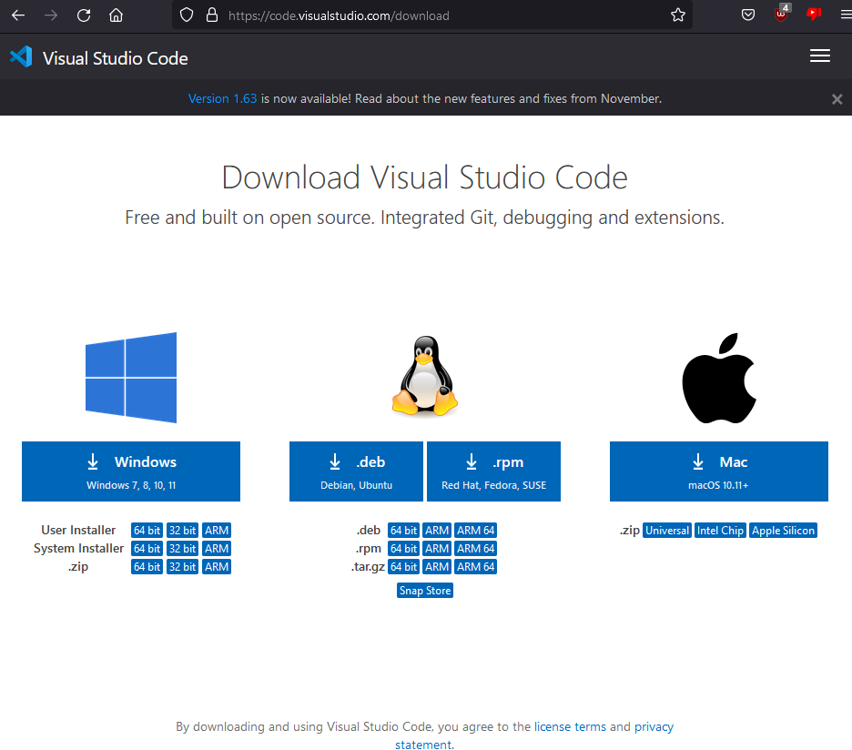  
Once you have installed it, visit the extension tab and download "Extension Pack for Java" and "Remote - SSH".  
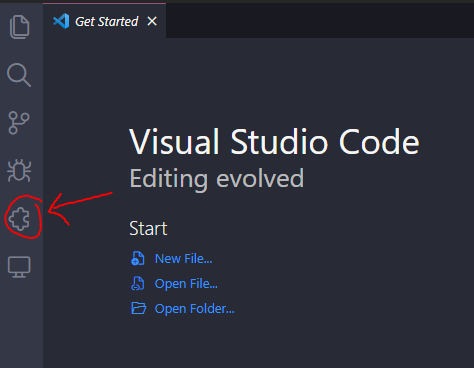  
  
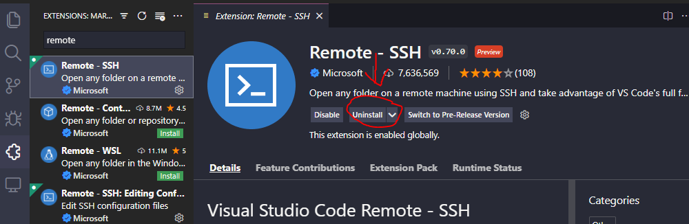  
*Note: Mine are already installed so it says "Uninstall" but yours will say Install if you have not already installed it.*  
Now you are ready to create and send over files!  
  
## **2. Remotely Connecting**  
Because I am on windows, I needed to install OpenSSH which you can do by following the instructions [Here](https://docs.microsoft.com/en-us/windows-server/administration/openssh/openssh_install_firstuse)  
*Note: You can skip this step if you are not on Windows*  
Next, look up your course account at UCSD's account look up tool [Here](https://sdacs.ucsd.edu/~icc/index.php)  
Now that you have things set up, start by opening VScode's terminal which you can access Ctrl or Command + ` or in the Terminal menu option. You should see something like this:  
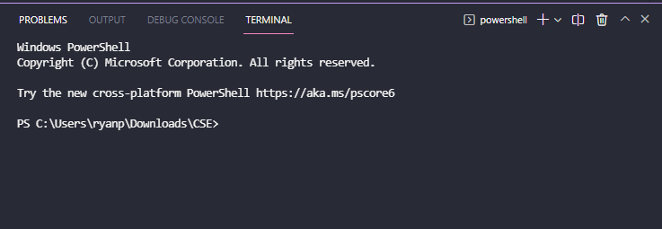  
In the terminal type: ```ssh cs15lwi22zz@ieng6.ucsd.edu```
*Note: "zz" should be replaced with your account.*  
Once prompted, enter ur course-specific account password.  
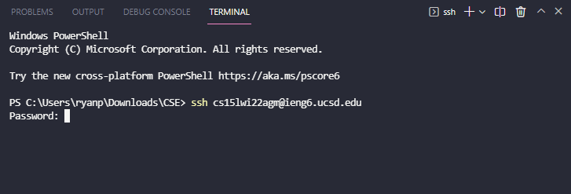  
If this is your first time that you've connected to this server you will get a message similar to this:  
```
The authenticity of host 'ieng6.ucsd.edu (128.54.70.227)' can't be established.
RSA key fingerprint is SHA256:ksruYwhnYH+sySHnHAtLUHngrPEyZTDl/1x99wUQcec.
Are you sure you want to continue connecting (yes/no/[fingerprint])? 
```  
Type yes and you should see somethng like this:  
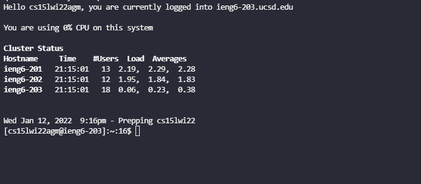  
Congratulations! You are now connected to your course-specific account on ieng6!  
  
## **3. Trying Some Commands**  
Test out running some commands! Some commands are:  
* pwd  
* ls  
* ls -lat  
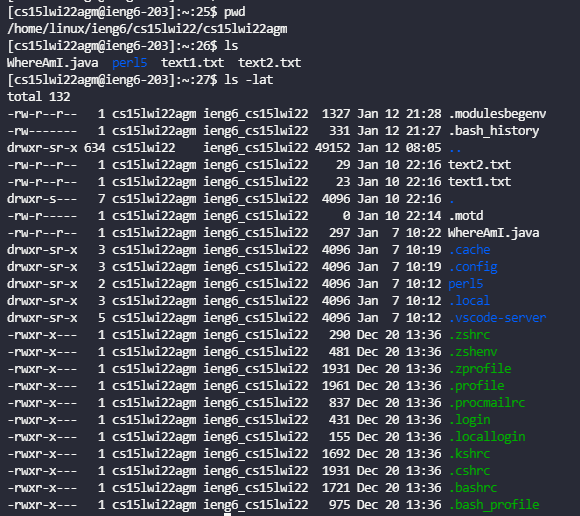  
To log out type exit.  
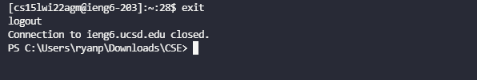  
  
## **4. Moving Files with scp**  
To begin moving files, start with creating a file that you want to move. I will be moving a WhereAmI.java file with the following code:  
```
class WhereAmI {
  public static void main(String[] args) {
    System.out.println(System.getProperty("os.name"));
    System.out.println(System.getProperty("user.name"));
    System.out.println(System.getProperty("user.home"));
    System.out.println(System.getProperty("user.dir"));
  }
}
```
Then on your computer run this command:  
```scp WhereAmI.java cs15lwi22zz@ieng6.ucsd.edu:~/```  
*Note: Again, "zz" should be replaced with your username. Also WhereAmI.java should be replaced with the name of the file you want to copy over.*  
Just like with logging in with ssh, enter your password.  
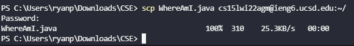  
Once sent, log back into ssh and use ```ls```. Your file should now be in your home directory.  
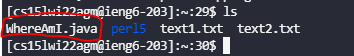  
  
## **5. Setting an SSH Key**  
To avoid having to type our password everytime we login or run scp, we can set up a SSH key. On your client, type ```ssh-keygen```.  
Because I am on Windows, I need to follow extra ssh-add steps which can be found [Here](https://docs.microsoft.com/en-us/windows-server/administration/openssh/openssh_keymanagement#user-key-generation)  
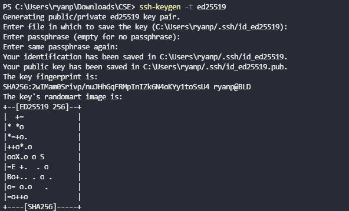  
Copy the **public** key to the .ssh directory of your course specific account (id_rse.pub)  
```
$ ssh cs15lwi22zz@ieng6.ucsd.edu
<Enter Password>
# now on server
$ mkdir .ssh
$ <logout>
# back on client
$ scp /Users/joe/.ssh/id_rsa.pub cs15lwi22@ieng6.ucsd.edu:~/.ssh/authorized_keys
# You use your username and the path you saw in the command above
```
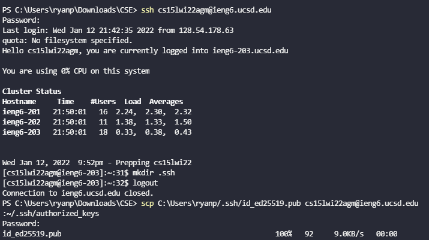  
Now, when you log in, you no longer need to use your password.  
**Before:**  
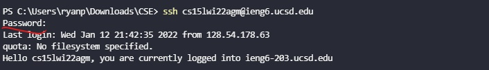  
**After:**  
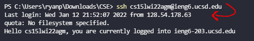  
  
## **6. Optimizing Remote Running**  
You can make remote running more efficient by running certain commands.  
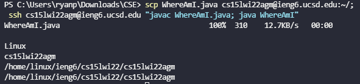  
By using semicolons, you can run multiple commands on the same line and by using "", you can directly run ssh commands on the remote server.  
By copy and pasting this line: ```scp WhereAmI.java cs15lwi22agm@ieng6.ucsd.edu:~/; ssh cs15lwi22agm@ieng6.ucsd.edu "javac WhereAmI.java; java WhereAmI"```, I can update local edits to the remote server and running with one press rather than having to copy the file over, logging in to the server, and then compiling and running the file.    
  
Hopefully, after reading my post, you are now able to login to your course-specfic account on ieng6 using VScode, moving over files, and optimizing running commands.  