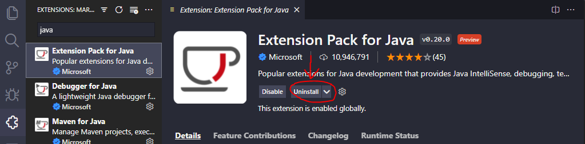

## Lab Report 1  
  
This is a screenshot of my index.  
  
## Connecting to ieng6  
Hello incoming 15L students! *(and possibly future me)*  
This post will demonstrate how **you** can connect to your course-specific acccount on ieng6!  
**1. Installing VScode**  
Download VScode from its website for the platform you are using it on. (I am running it on Windows)  
  
Once you have installed it, visit the extension tab and download "Extension Pack for Java" and "Remote - SSH".  
  
  
  
**Note: Mine are already installed so it says "Uninstall" but yours will say Install if you have not already installed it.*  
Now you are ready to create and send over files!  
**2. Remotely Connecting**  
Because I am on windows, I needed to install OpenSSH which you can do by following the instructions [Here](https://docs.microsoft.com/en-us/windows-server/administration/openssh/openssh_install_firstuse)  
**Note: You can skip this step if you are not on Windows*  
Next, look up your course account at UCSD's account look up tool [Here](https://sdacs.ucsd.edu/~icc/index.php)  
Now that you have things set up, start by opening VScode's terminal which you can access Ctrl or Command + ` or in the Terminal menu option. You should see something like this:  
  
In the terminal type: ```ssh cs15lwi22zz@ieng6.ucsd.edu```
**Note: "zz" should be replaced with your account.*  
  