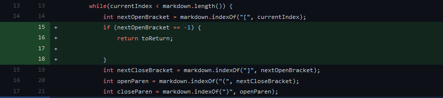
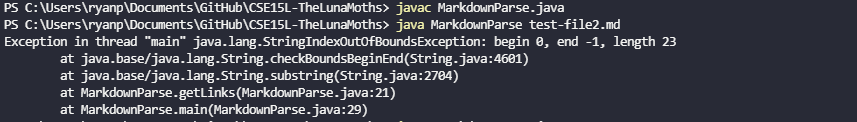
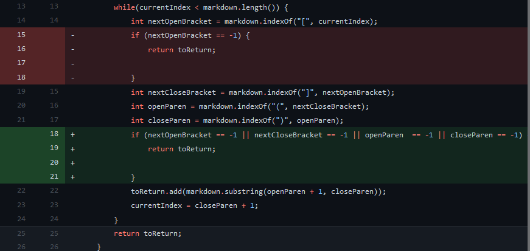
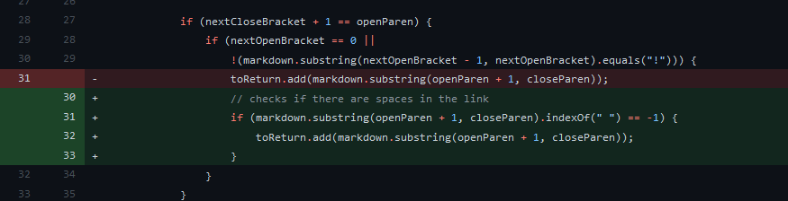
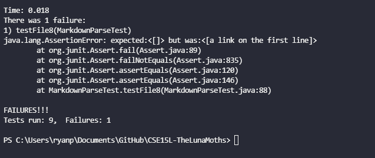

# Lab Report 2

## Change Number 1
  

Error producing file: [test-file2.md](https://github.com/kungryan/CSE15L-TheLunaMoths/blob/main/test-file2.md)  

   
The failure inducing input is a result of using test-file2.md. The symptom shown is that an out of bounds error is given for the file. This is because of a bug in the code as there is no statement to check if it uses brackets `[]`, which is the proper syntax for defining links in a markdown file. The change checks if the file has brackets to indicate that there is a link.

## Change Number 2

Error producing file: [test-file3.md](https://github.com/kungryan/CSE15L-TheLunaMoths/blob/main/test-file3.md)  
  
The failure inducing input is a result of using test-file3.md. While there are no errors, the symptom shown is that it is printing an array with contents that are not links. This is because of a bug in the code that treats anything with brackets as a link. The change checks if the file is in the specified format ``.

## Change Number 3
   

Error producing file: [test-file8.md](https://github.com/kungryan/CSE15L-TheLunaMoths/blob/main/test-file8.md)  
   

The failure inducing input is a result of using test-file2.md. The symptom shown in running the test case is that it gives us `[a link on the first line]` when it should have been an empty array `[]`. The bug in the code is that there is no check for non-links within the `()`. The change checks if the contents inside the `()` has a space, and if it does, it indicates that the content is not a link. 