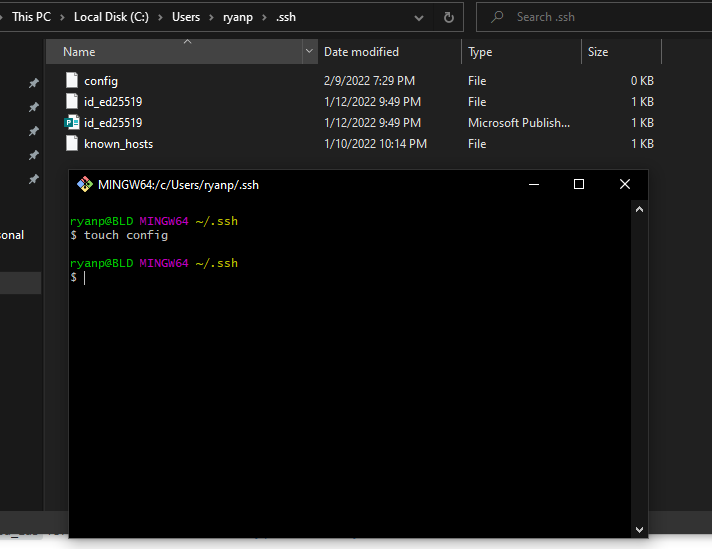
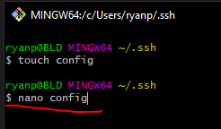
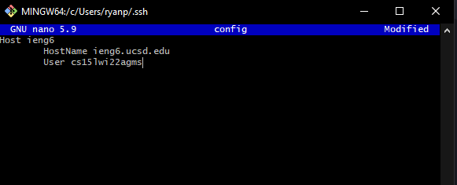
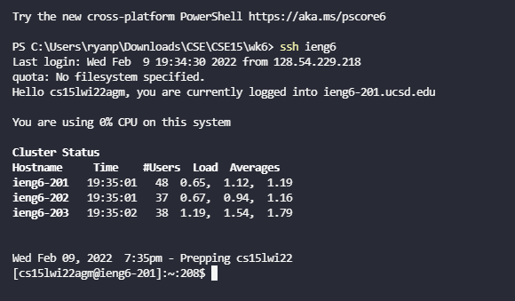
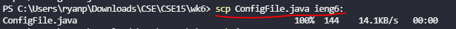
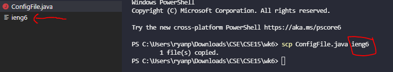
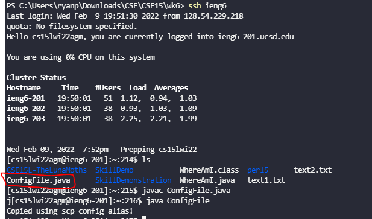

# Lab Report 3

## Streamlining ssh Configuration
  
To make it easier to login to my UCSD Course specific account, I can use a ssh config so I don't have to type out `ssh cs15lwi22agm@ieng6.ucsd.edu` everytime.  
  
## Making the Config  
First, I had to find my .ssh folder. On Windows, it was located in C:\Users\ryanp\\.ssh  
Then to create my config folder, I right clicked to open a list of options and selected "Git Bash Here".  
   

Clicking on "Git Bash Here" opened a terminal. To create the config, I typed: `touch config`  
  
  
Then I typed `nano config` to open an edit the config.  
  
Then I typed out `Host ieng6`, ieng6 being the alias name, followed by `HostName ieng6.ucsd.edu`
and `User cs15lwi22agm` which are the parts of my course specific account.  
  

Finally, I saved with Ctrl-S and now my Config is set up.  
  
## Running the SSH using the Alias  
Now to run the ssh with my new alias, all I needed to type was `ssh ieng6`.  
  
This was much easier to type than `ssh cs15lwi22agm@ieng6.ucsd.edu`! Now I only needed to type 9 characters instead of 31, saving a total of 22 characters!  
  
## Copying files using the Alias  
To copy over a file, I created the java file:  
ConfigFile.java  
```
public class ConfigFile {
    public static void main(String[] args) {
        System.out.println("Copied using scp config alias!");
    }
}
```
Then to copy it I typed `scp ConfigFile.java ieng6:`. 
  
  
Something important to note here is that I needed to type my alias as `ieng6:` instead of just `ieng6` as typing it without the colon simply created a text document called ieng6 in my current directory.  
  
  
Logging onto my course specifc account again, I used ls to see if my file was uploaded and it was. I also compiled and ran it to make sure it was properly copied over.  
  
  
   
  
  


Using an alias name with a ssh config is an effective way to reduce the amount of time spent typing out the host name.  