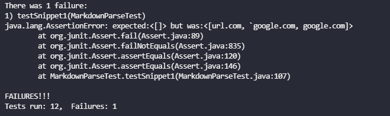
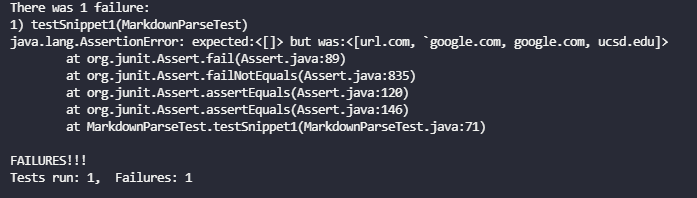
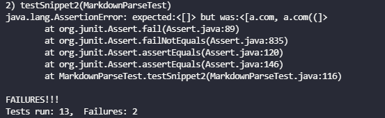
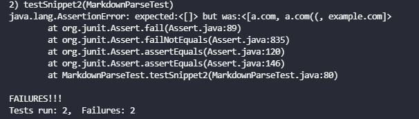
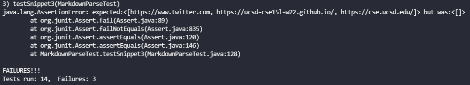
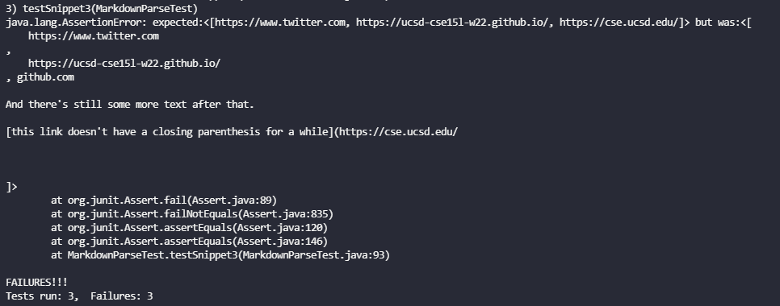
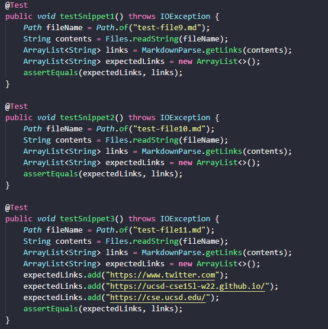
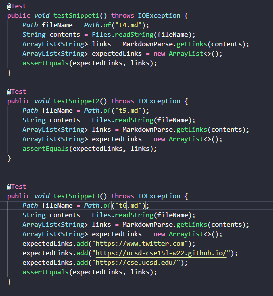

# Lab Report 4

## Implementations of Markdown Parse
My implementation of markdown-parse: [here](https://github.com/kungryan/CSE15L-TheLunaMoths)  
The implementation I reviewed: [here](https://github.com/yaz067/markdown-parse)  
  
## Code Snippets

**Snippet 1**  
```
`[a link`](url.com)

[another link](`google.com)`

[`cod[e`](google.com)

[`code]`](ucsd.edu)
```  
My code:  
  
Their code:  
  
Both of our code's failed to recognize failed to recognize the backticks as invalid links. I believe that this issue can be solved with a small code change. I believe that we can solve this issue by checking whether or not the code has a backtick. If it finds a backtick, the link is invalid.  
  
**Snippet 2**  
```
[a [nested link](a.com)](b.com)

[a nested parenthesized url](a.com(()))

[some escaped \[ brackets \]](example.com)
```
My code:  
  
Their code:  
  
Both of our codes failed to recognize the nested brackets and parenthesis as invalid links. My code did recognize the escaped brackets as an invalid link but the code I reveiewed did not. I believe that this issue can be solved with a small code change. I believe that we can solve this issue by recognizing that any part with more than 2 parenthesis or brackets are invalid links.  
  
**Snippet 3**
```
[this title text is really long and takes up more than 
one line

and has some line breaks](
    https://www.twitter.com
)

[this title text is really long and takes up more than 
one line](
    https://ucsd-cse15l-w22.github.io/
)


[this link doesn't have a closing parenthesis](github.com

And there's still some more text after that.

[this link doesn't have a closing parenthesis for a while](https://cse.ucsd.edu/


)

And then there's more text
```  
My code:  
  
Their code:  
  
Both of our codes failed to recognize the links properly. My code failed to recognize the lines with line breaks as links, whereas the code I reviewed recognized all of them as links, even the one without the closing parenthesis. I do think that this issue can be solved with a small code change. We can solve this issue by removing spaces inside links and line breaks within brackets and parenthesis. The code I reviewed can also make a check that a link has both () in order for the link to be valid.  
  
## Tests  
**My tests:**  
  
**Their test:**  
  
I decided to use the way I tested my cases to test their code as the way they had theirs setup was a bit confusing. They tested all their links at once using a for loop which I think is harder to show and understand. 