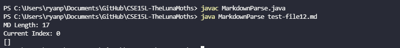
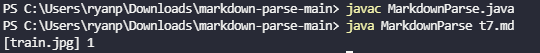
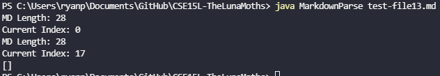
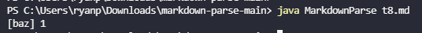

# Lab Report 5  

## The Tests  
For the tests, I searched through the test cases manually and tested them both to see if they were different. I looked through for test cases for potentially incorrect cases and seeing if the two tests produced different answers. While this was easy to do, it was tedious to look through a bunch of tests.  
I ended up choosing these two tests:  
**1** 
```

```  
**2** 
```
[foo]: <bar>(baz)

[foo]
```  
## The Results
**Test #1**  
My implementation:  
  
Given implementation:  
  
The implementation that I think is correct is my implementation. The test case given is an image so no links should be returned at all. My implementation produces nothing while the given implementation returns train.jpg as the link. A fix for this could be adding a check that checks for the ! before [ which will let the program know that it is an image and not a link.  
  

**Test #2**  
My implementation:  
  
Given implementation:  
  
The implementation that I think is correct is my implementation. The test case given has multiple things that prevent it from being a link. The spaces, colon, and angle brackets should make it so that it is not a link but the given implementation sees it as so. A fix for this could be making a check that checks that the ( comes right after ] which is the proper link format in markdown.  